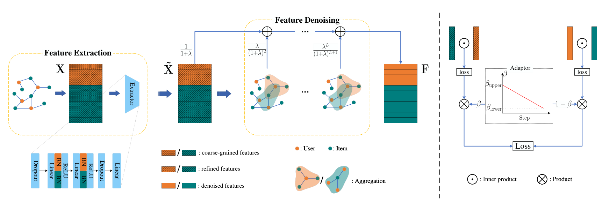

# StableGCN: Decoupling and Reconciling Information Propagation for Collaborative Filtering





**Note:** 
Performing the SVD in a CUDA environment will accelerate the process;
however, due to an unknown error, we conducted it using the CPU.
Other details follow [SVD-GCN](https://github.com/tanatosuu/svd_gcn).

## Requirements

Python==3.9 | [PyTorch==1.12.1](https://pytorch.org/) | [freerec==0.4.3](https://github.com/MTandHJ/freerec)

## Usage

We provide configs and experimental logs.  You can re-run them and try some other hyperparameters:

```
python main.py --config=configs/xxx.yaml
```